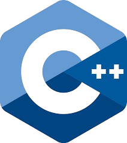
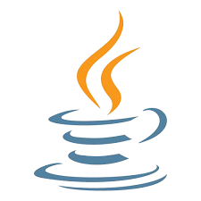
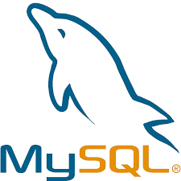
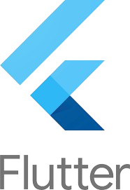

## Hi there 👋
I'm owen, a person who love to analysis in depth of game aspect, in short, My friends / people called me a "Nerd" Gamer.
I enjoyed being a Nerd Gamer, because it's help me on various aspects that's important or related to my job.
## Benefit for being Nerd Gamer:
  - Good Analytics skills since it's required understanding data from the game attributes/ aspect. The Analytics is more toward to a questions that always poop on my head : "how i can dominate the tournament/pvp easily", "how i can win this tournament without struggle" or "what the best method to maximize stats" and so on...
  - Improvising Problem Solving, as i said above, because i need to understand the game a lot deeper rather than average people who enjoy playing it casually.
  - Reliable Teammate, because you study the game, so your teammate can win easily.
    
Also I'm currently improving my English Abilities, especially on speaking. so eager to look forward to collaborate or communicate with english speaker/ community.

Fun fact:
- Addicted to Horse Game.
- Umamusume is my favorite anime.
- I type faster in english rather than my native langauge(Indonesia)

## Proficient in these tools:

 

<!--
**owenrud/owenrud** is a ✨ _special_ ✨ repository because its `README.md` (this file) appears on your GitHub profile.

Here are some ideas to get you started:

- 🔭 I’m currently working on ...
- 🌱 I’m currently learning ...
- 👯 I’m looking to collaborate on ...
- 🤔 I’m looking for help with ...
- 💬 Ask me about ...
- 📫 How to reach me: ...
- 😄 Pronouns: ...
- ⚡ Fun fact: ...
-->
